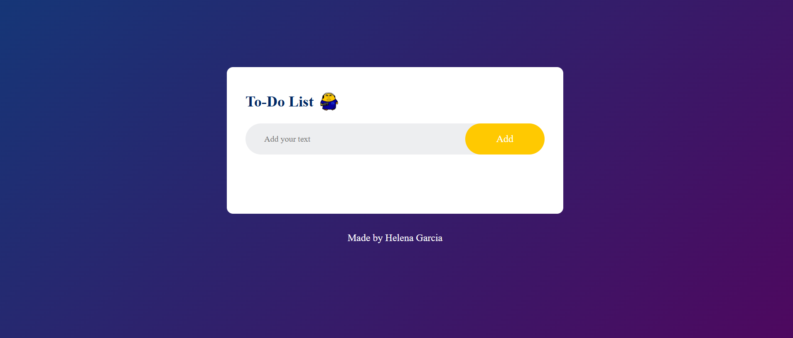

# CS++ To-Do List ✅

A simple to-do list web app I built to keep track of my tasks as Chairperson of the
**CS++ Society** at TU Dublin. Running a society means a lot of small tasks,
and I wanted a fast way to note them down.

🔗 **[Live demo](https://garciahelena.github.io/ToDoList/)** *(turn on GitHub Pages, see below)*




## ✨ Features

- Add tasks with a text input
- Mark tasks as completed
- Delete tasks
- Tasks are saved in the browser between visits (`localStorage`)

## 🛠️ Built with

- **HTML5**: page structure
- **CSS3**: layout and styling
- **JavaScript (vanilla)**: adding, completing and removing tasks with DOM manipulation

No frameworks or build tools. Just open `index.html`.

## ▶️ Run it locally

```bash
git clone https://github.com/garciahelena/ToDoList.git
cd ToDoList
```
Then open `index.html` in your browser.

> **Why it isn't shared yet:** right now tasks live in each person's own browser,
> so other people can't see them. Sharing needs a server and database, which is the
> main goal for the next version.

## 🗂️ Project structure

```
ToDoList/
├── images/
├── index.html
├── script.js
├── style.css
└── README.md
```

## 🧠 What I learned

- Handling click events and updating the page with JavaScript (DOM manipulation)
  

## 📫 Contact

[LinkedIn](https://www.linkedin.com/in/ahelenagarcia) · [GitHub](https://github.com/garciahelena)
